## JVM 如何运行 Java 代码

Java 代码运行分为两个阶段：编译期和运行时

**编译期(build)：**

- 在编译阶段，Java 会将 Java 源代码编译为字节码文件，字节码文件中包含了 JVM 执行的指令、类的元数据信息（类名、方法和属性等）等

- 字节码并不是机器码，操作系统无法直接识别，需要在操作系统上安装不同版本的 JVM 来识别

**运行时(run)：**

- JVM 会先通过类加载器加载字节码文件，然后将字节码加载到 JVM 的运行时数据区，再通过执行引擎转化为机器码，最终交给操作系统执行
- 可以使用 `javap` 查看字节码指令序列，使用 `hexdump` 以十六进制形式查看文件内容
- JVM 解析字节码指令来完成程序执行，常见的执行方式有两种：
  - 解释执行：对字节码逐条解释执行
  - JIT：即时编译，在运行时将热点代码优化并缓存起来，下次再执行时直接使用缓存的机器码

以一个最简单的程序为例：

1. **查看编译后的字节码**

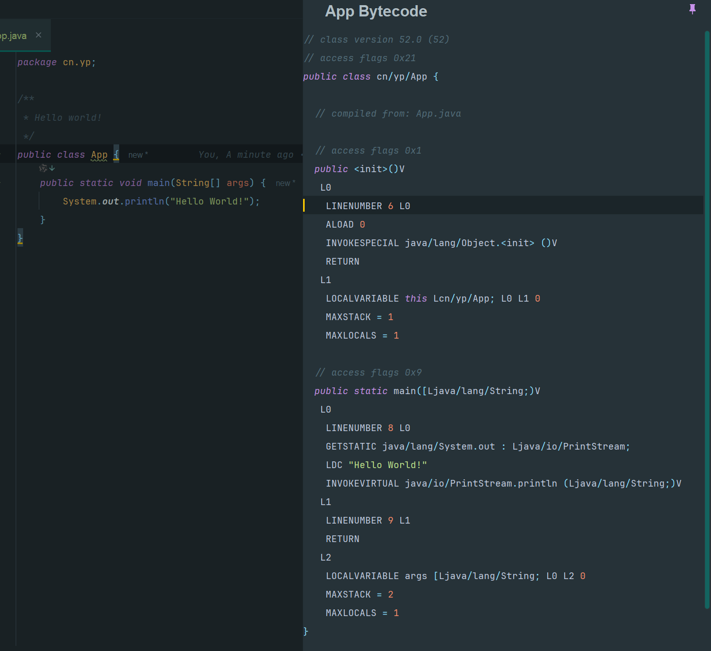

左边为源代码，右边即是其字节码。IDEA直接打开 `.class`文件看到和源代码类似的内容是因为其反编译让人容易阅读

可以使用工具 `jclasslib Bytecode Viewer` 直观地查看对应的字节码、类的基本信息等

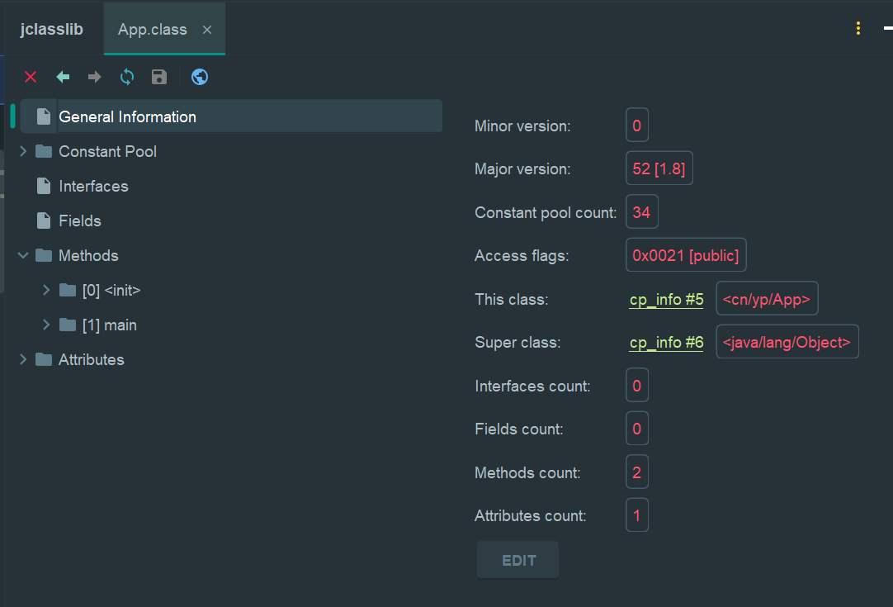

2. 使用 `javap -c ClassName` 查看字节码指令序列

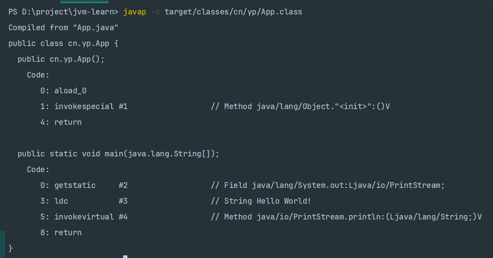

字节码指令序列通常有多条指令组成，每条指令由一个操作码和若干操作数构成（看不懂没关系，让 chat 解释）

3. 关于字节码指令序列在 JVM 的运行时数据区的运行状态，后面在 JVM 运行时内存区再说

## Java 的类加载机制

什么是 Java 的类加载机制？

JVM 运行 Java 代码的时候，需要将编译后的字节码文件加载到其内部的运行时数据区域中进行执行。类加载机制顾名思义，就是将 Java类加载到这个运行时数据区的过程。

类加载器通过双亲委派机制来进行 Java 类的加载过程，保证了安全性和避免重复加载

### 类的生命周期

类从被加载到 JVM 开始，到卸载出内存，整个生命周期分为七个阶段，分别是加载、验证、准备、解析、初始化、使用、卸载。其中验证、准备、解析这三个阶段统称为连接。

除去使用和卸载，就是 Java 的类记载过程。这 5 个阶段一般是顺序发生的，但是在动态绑定的情况下，解析阶段发生在初始化阶段之后。

**加载 Loading：**

JVM 在该阶段的目的是将字节码从不同的数据源转化为二进制字节流加载到内存中，并生成一个代表该类的`java.lang.Class`对象

**验证 Verification：**

JVM 会在该阶段对二进制字节流进行校验，只有符合 JVM 字节码规范的才能被 JVM 正确执行。

**准备 Prepartion：**

JVM 对类变量（static）分配内存并初始化，对应数据类型的默认初始值。例如：

```Java
public String s1 = "湖北";
public static String s2 = "武汉";
public static final String s3 = "小米";
```

在这一阶段 s1 不会被分配内存，s2 分配内存并初始化为 `null`，s3 分配内存并初始化为`小米`

因为 static final 修饰的变量被称为常量，一旦赋值就不会改变

**解析 Resolution：**

将常量池中的符号引用转化为直接引用

|      | 符号引用                                                     | 直接引用                                                     |
| ---- | ------------------------------------------------------------ | ------------------------------------------------------------ |
| 定义 | 包含了类、字段、方法、接口等多种符号的全限定名               | 直接指向目标的指针、相对偏移量或者能间接定位到目标的句柄     |
| 特点 | 在编译时生成，存储在编译后的字节码文件的常量池中             | 在运行时生成，依赖于具体的内存布局                           |
|      | 以一组符号来描述所引用的目标不依赖于具体的内存地址，提供更好的灵活性 | 通过对符号引用进行解析，找到引用的实际内存地址由于直接指向了内存地址或者偏移量，所以通过直接引用访问对象的效率较高 |

Java 本身是一个静态语言，但是后面又加入了动态加载特性，因此，解析阶段需要从两个方面考虑：

- 不涉及动态加载，那么一个符号的解析结果是可以缓存的，可以避免多次解析同一个符号
- 使用了动态加载，前面使用动态加载解析过的符号后面重新解析结果可能会不同。**使用动态加载时解析过程发生在程序执行到这条指令的时候**

解析阶段的工作：

- 类或接口的解析
- 类方法解析
- 接口方法解析
- 字段解析

**初始化 Initialization：**

在准备阶段，类变量已经被赋过默认初始值；而在初始化阶段，类变量将被赋值为代码期望的值

**初始化阶段是执行类构造器方法的过程**

初始化时机包括：

- 创建类的实例
- 访问类的静态方法或静态字段时
- 使用`java.lang.reflect`包的方法对类进行反射调用时
- 初始化一个类的子类（首先会初始化父类）
- JVM 启动时，用户指定的主类（包含 main 方法的类）将被初始化

### 类加载器

对于任意一个类，都需要由它的类加载器和这个类本身一同确定其在 JVM 中的唯一性。如果两个类的类加载器不同，即使两个类来源于同一个字节码文件，这两个类也必不相等

类加载器分为四种：

1. 引导类加载器（Bootstrap ClassLoader）：负责加载 JVM 基础核心类库
2. 扩展类加载器（Extension ClassLoader）：负责加载 Java 扩展库中的类，例如 jre/lib/ext 目录下的类或由系统属性`java.ext.dirs`指定位置的类
3. 系统（应用）类加载器（System ClassLoader）：负责加载系统类路径`java.class.path` 上指定的类库，通常是你的应用类和第三方库
4. 用户自定义类加载器：Java 允许用户创建自己的类加载器，通过继承`java.lang.ClassLoader` 类的方式实现。这在需要动态加载资源、实现模块化框架或者特殊的类加载策略时非常有用

### 双亲委派模型

双亲委派模型（Parent Delegation Model）是 Java 类加载器使用的一种机制，用于确保 Java 程序的稳定性和安全性。在这个模型中，类加载器在尝试加载一个类时，首先会委派给其父加载器去尝试加载这个类，只有在父加载器无法加载该类时，子加载器才会尝试自己去加载。

1. **委派给父加载器**：当一个类加载器接收到类加载请求时，它首先不会尝试自己去加载这个类，二十将这个请求委派给它的父加载器。
2. **递归委派**：这个过程会递归向上进行，从启动类加载器（Bootstrap ClassLoader）开始，再到扩展类加载器（Extension ClassLoader），最后到系统类加载器（System ClassLoader）。

- **加载类**：如果父加载器可以加载这个类，那么就使用父加载器的结果。如果父加载器无法加载这个类（它没有找到这个类），子加载器才会尝试自己去加载。

**安全性和避免重复加载**：这种机制可以确保不会重复加载类，并保护 Java 核心 API 的类不被恶意替换。

双亲委派模型能够保证同一个类最终会被特定的类加载器加载。

## Java 类文件结构

Java 类文件也就是 `.class`文件结构，是一串连续的二进制，由 0 和 1 组成。内容通常可以包括：魔数、版本号、常量池、访问标记、类索引、父类索引、接口索引、字段表、方法表、属性表。

- 常量表包含了类、接口、字段和方法的符号引用，以及字符串字面量和数值常量。
- 访问标记用于识别类或接口的访问信息，比如说是不是 public | private | protected，是不是 static，是不是 final 等。
- 类索引、父类索引和接口索引用来确定类的继承关系。
- 字段表用来存储字段的信息，包括字段名，字段的参数，字段的签名。
- 方法表用来存储方法的信息，包括方法名，方法的参数，方法的签名。
- 属性表用来存储属性的信息，包括字段的初始值，方法的字节码指令等

## JVM 运行时数据区

Java 源代码文件经过编译器编译后生成字节码文件，经过加载器加载完毕后会交给执行引擎执行。在执行的过程中，JVM 会划分一块空间来存储程序执行期间需要用到的数据，即运行时数据区。

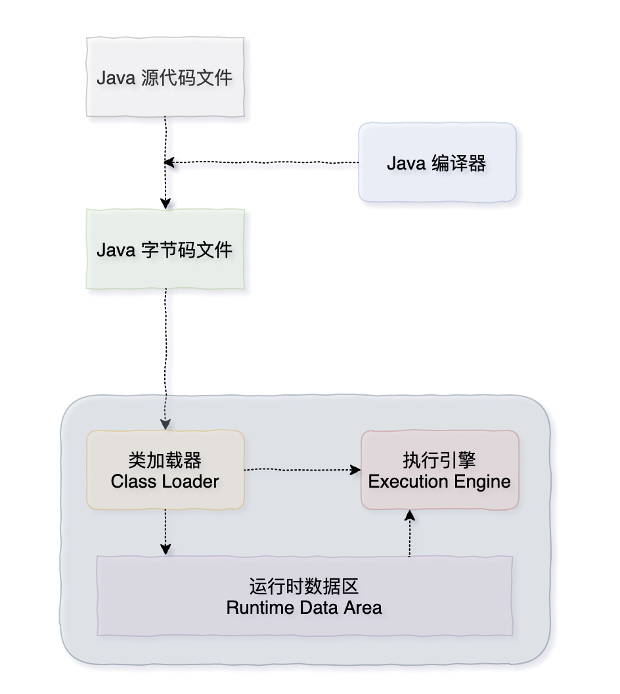

运行时数据区可以氛围以下几个部分：

- 程序计数器
- Java 虚拟机栈
- 本地方法栈
- 堆
- 方法区与元空间

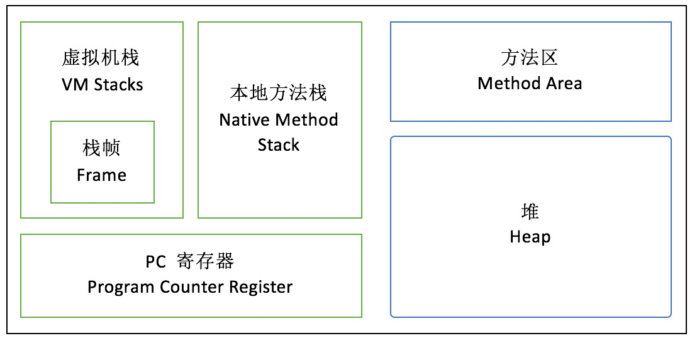

运行时数据区的主要组成：

- PC 寄存器（PC Register），也叫程序计数器（Program Counter Register），是一块较小的内存空间，指向下一条需要执行的字节码指令
- JVM 栈（Java Virtual Machine Stack），与 PC 寄存器一样，JVM 栈也是线程私有的。每一个 JVM 线程都有自己的 JVM 栈（也叫方法栈），这个栈与线程同时创建，它的生命周期与线程相同。
- 本地方法栈（Native Method Stack），JVM 可能会使用到传统的栈来支持 Native 方法的执行，这个栈就是本地方法栈。
- 堆（Heap），在 JVM 中，堆是可供各条线程共享的运行时内存区域，也是供所有类实例和数据对象分配内存的区域。
- 方法区（Method area），JDK 8 开始，使用元空间取代了永久代。**方法区是** **JVM** **中的一个逻辑区域**，用于存储类的结构信息，包括类的定义、方法的定义、字段的定义以及字节码指令。不同的是，元空间不再是 JVM 内存的一部分，而是通过本地内存（Native Memory）来实现的。
- **运行时常量池**，运行时常量池是每一个类或接口的常量在运行时的表现形式，它包括了编译器可知的数值字面量，以及运行期解析后才能获得的方法或字段的引用。简而言之，当一个方法或者变量被引用时，JVM 通过运行时常量区来查找方法或者变量在内存里的实际地址。

### 程序计数器

可以看作是当前线程所执行的字节码指令的行号指示器，**指向了下一条需要执行的字节码指令**。

JVM 的多线程首先是通过线程轮流切换来获得 CPU 执行时间的，在任一具体时刻，CPU的内核只会执行一条线程中的指令，**所以程序计数器是线程私有的**

如果线程执行的是非本地方法，则程序计数器中保存的是当前需要执行的指令地址；如果线程执行的是本地方法，则程序计数器中的值是 undefined

### Java 虚拟机栈

Java 虚拟机栈中是一个个栈帧，每个栈帧对应一个被调用的方法。当线程执行一个方法时，会创建一个对应的栈帧，并将栈帧压入栈中。当方法执行完毕后，将栈帧从栈中移除。

栈帧包含 5 个部分：

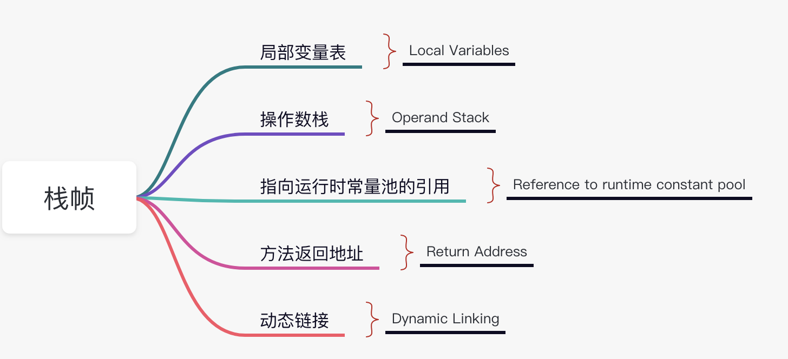

Java 虚拟机栈特点：

- 线程私有：每个线程都有自己的 JVM  栈，线程之间的栈是不共享的
- 栈溢出：如果栈的深度超过了 JVM 栈所允许的深度，将会抛出 `StackOverflowError`

`java -XX:+PrintFlagsFinal -version | grep ThreadStackSize`命令可以查看 JVM 栈的默认大小

### 本地方法栈

本地方法栈与 Java 虚拟机栈类似，不过是为虚拟机使用到的 Native 方法服务

### 堆

堆是所有线程共享的一块内存区域，在 JVM 启动的时候创建，用来存储对象

Java 中几乎所有对象都会在堆中分配，但随着 JIT 编译器的发展和逃逸技术的逐渐成熟，所有对象分配到堆上渐渐变得不那么“绝对”了。

堆 Java 7 开始，Java虚拟机已经默认开启逃逸分析了，**如果某些方法中的对象引用没有被返回或者未被外面使用（也就是未逃逸出去），那么对象可以直接在 JVM 栈上分配内存**

逃逸分析：一种编译器优化技术，用于判断对象的作用域和生命周期。如果编译器确定一个对象不会逃逸出方法或线程的范围，它可以选择在栈上分配这个对象，而不是堆上。这样可以减少垃圾回收的压力，并提高性能。

堆可能出现 `OutofMemoryError`错误：

- `OutOfMemoryError: GC Overhead Limit Exceeded`：当 JVM 花太多时间执行垃圾回收并且只能回收很少的堆空间时，就会发生该错误
- `java.lang.OutOfMemoryError` Java heap space：假如在创建新的对象时, 堆内存中的空间不足以存放新创建的对象, 就会引发该错误。和本机的物理内存无关，和我们配置的虚拟机内存大小有关

`java -XX:+PrintFlagsFinal -version | grep HeapSize`可以查看 JVM 堆默认大小

### 方法区

> 方法区是 Java 虚拟机规范上的一个逻辑区域，在不同的 JDK 版本上有着不同的实现。在 JDK 7 的时候，方法区被称为永久代（PermGen），而在 JDK 8 的时候，永久代被彻底移除，取而代之的是元空间。
>
> 《Java 虚拟机规范》中只规定了有方法区这么一个概念和它的作用，并没有规定如何去实现它。不同的 Java 虚拟机可能就会有不同的实现。永久代是 HotSpot 对方法区的一种实现形式。也就是说，永久代是 HotSpot 旧版本中的一个实现，而方法区则是 Java 虚拟机规范中的一个定义，一种规范。
>
> 换句话说，方法区和永久代的关系就像是 Java 中接口和类的关系，类实现了接口，接口还是那个接口，但实现已经完全升级了。

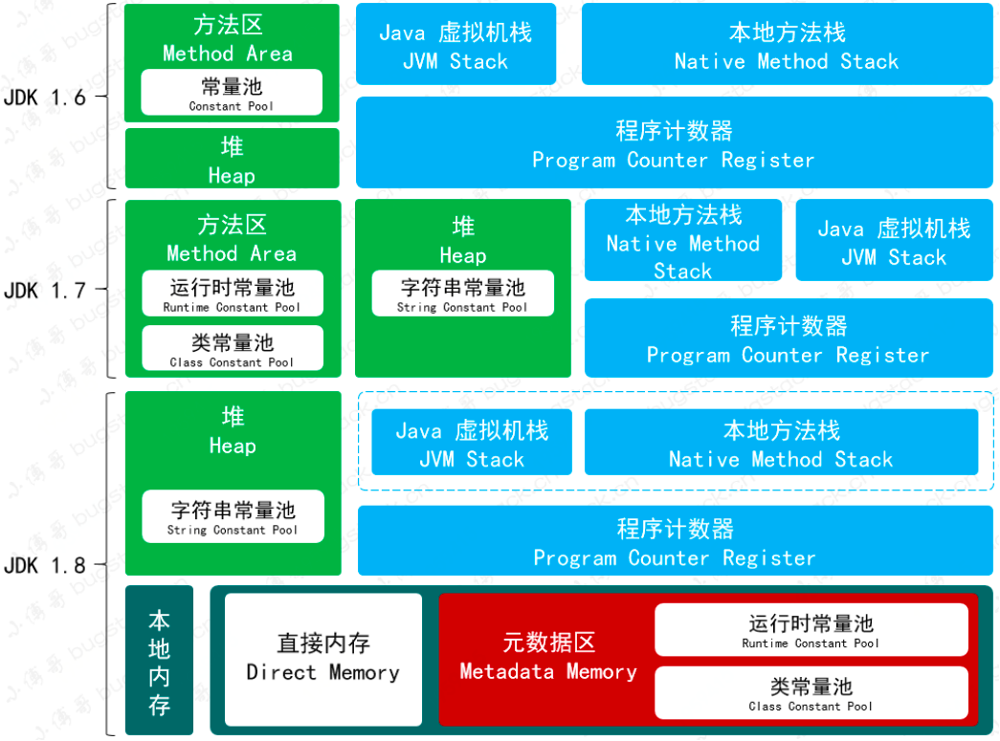

- JDK 7 之前，只有常量池的概念，都在方法区中
- JDK 7 的时候，字符串常量池从方法去中拿出来放到了堆中，运行时常量池还在方法区（也就是永久代）中
- JDK 8 的时候，HotSpot 移除了永久代，取而代之的是元空间。字节串常量池还在堆中，而运行时常量池跑到了元空间。

**为什么要废弃永久代，而使用元空间来进行替换呢？**

> 旧版的 Hotspot 虚拟机是没有 JIT 的，而 Oracle 旗下的另外一款虚拟机 JRocket 是有的，那为了将 Java 帝国更好的传下去，Oracle 就想把庶长子 JRocket 的 JIT 技术融合到嫡长子 Hotspot 中。
>
> 但 JRockit 虚拟机中并没有永久代的概念，因此新的 HotSpot 索性就不要永久代了，直接占用操作系统的一部分内存好了，并且把这块内存取名叫做元空间。
>
> **元空间的大小不再受限于 JVM 启动时设置的最大堆大小，而是直接利用本地内存，也就是操作系统的内存。有效地解决了 OutOfMemoryError 错误。**

当元空间的数据增长时，JVM 会请求操作系统分配更多的内存。如果内存空间足够，操作系统就会满足 JVM 的请求，从而影响元空间的动态扩展。

**运行时常量池：**

在运行时期间，JVM 会将字节码文件中的常量池加载到内存中，存放在运行时常量池中。

**字符串常量池：**

存放字符串常量，也就是我们在代码中写的字符串。依然在堆中。

## JVM 的垃圾回收机制

垃圾回收就是对内存堆中已经死亡的或者长时间没有使用的对象进行清除和回收

要做垃圾回收，就需要判断什么是垃圾，即垃圾判断算法，常见的垃圾判断算法有引用计数算法和可达性分析算法

知道了哪些对象是垃圾之后，就需要进行收集，即垃圾收集算法。单一的垃圾回收算法并不适合所有对象的存活周期，在对象的不同周期阶段采用更加适合的垃圾回收算法

堆主要分为 2 个区域，新生代和老年代，新生代又可以分为 Eden 区和 Survivor 区， Survivor 区又分为 From 和 To 区

### 垃圾判断算法

**引用计数算法**

通过在对象头中分配一个空间来保存该对象被引用的次数，如果该对象被其它对象引用，则它的引用计数加 1，如果删除对该对象的引用，那么它的引用计数就减 1，当该对象的引用计数为 0 时，那么该对象就会被回收。

引用计数算法将垃圾回收分摊到整个应用程序的运行当中，而不是集中在垃圾收集时。因此，采用引用计数的垃圾收集不属于严格意义上的"Stop-The-World"的垃圾收集机制

引用计数法的问题：无法解决循环依赖问题，示例代码：

```java
public class ReferenceCountingGC {

    public Object instance;  // 对象属性，用于存储对另一个 ReferenceCountingGC 对象的引用

    public ReferenceCountingGC(String name) {
        // 构造方法
    }

    public static void testGC() {
        // 创建两个 ReferenceCountingGC 对象
        ReferenceCountingGC a = new ReferenceCountingGC("laterya");
        ReferenceCountingGC b = new ReferenceCountingGC("laterya");

        // 使 a 和 b 相互引用
        a.instance = b;
        b.instance = a;

        // 将 a 和 b 设置为 null
        a = null;
        b = null;

        // 这个位置是垃圾回收的触发点
    }
}
```

**可达性分析算法**

通过一些被称为引用链 GC Roots 的对象作为起点，然后向下搜索，从 GC Roots 到该对象节点不可达则证明该对象需要垃圾收集

通过可达性算法，成功解决了引用计数无法解决的问题-“循环依赖”，只要你无法与 GC Root 建立直接或间接的连接，系统就会判定你为可回收对象

作为 GC Root 的对象包括以下四种：

1. 虚拟机栈中引用的对象
2. 本地方法栈引用的对象
3. 类静态变量引用的对象
4. 常量引用的对象

### 垃圾收集算法

**标记-清除算法**

把内存区域中的对象进行标记，然后将垃圾进行清理

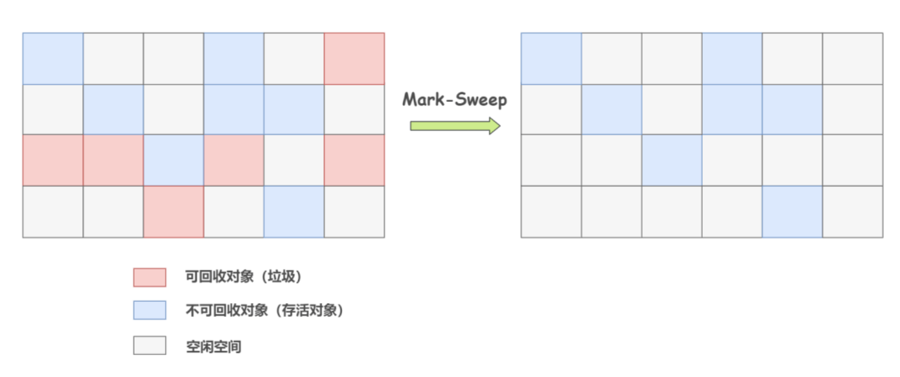

问题：内存碎片，碎片太多可能会导致当程序运行过程中需要分配较大对象时，因无法找到足够的连续内存而不得不提前触发新一轮的垃圾收集

**复制算法**

将可用内存按容量划分为大小相等的两块，每次只使用其中的一块。当这一块的内存用完了，就将还存活着的对象复制到另外一块上面，然后再把已使用过的内存空间一次清理掉。

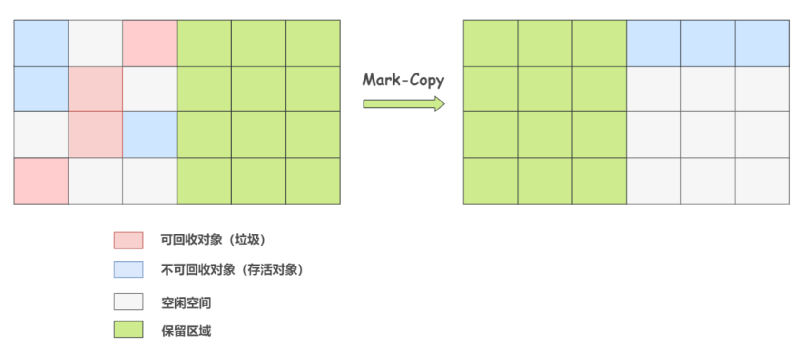

问题：解决了内存碎片，但是造成了内存的大量浪费（准确来说浪费一半）

**标记-整理算法**

在进行标记之后，让所有存活的对象都向一端移动，再清理掉端边界以外的内存区域

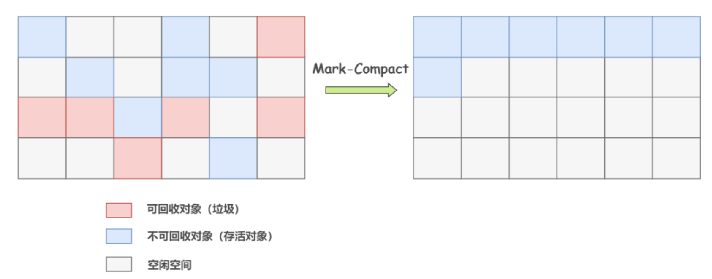

问题：解决了上面两个算法的问题，但是内存变动更加频繁，需要整理所有存活对象的引用地址，效率低

**分代收集算法**

按照对象存活周期的不同将内存划分为几块，根据各个年代的特点采用最适当的收集算法


在新生代中，每次垃圾收集时都发现有大批对象死去，只有少量存活，那就选用复制算法，只需要付出少量存活对象的复制成本就可以完成收集。

老年代中因为对象存活率高、没有额外空间对它进行分配担保，就必须使用标记清理或者标记整理算法来进行回收。

### 新生代和老年代

**Eden 区**

有将近 98% 的对象是朝生夕死，所以针对这一现状，大多数情况下，对象会在新生代 Eden 区中进行分配，当 Eden 区没有足够空间进行分配时，JVM 会发起一次 Minor GC，Minor GC 相比 Major GC 更频繁，回收速度也更快。

通过 Minor GC 之后，Eden 区中绝大部分对象会被回收，而那些无需回收的存活对象，将会进到 Survivor 的 From 区，如果 From 区不够，则直接进入 To 区。

**Survivor 区**

**为什么需要 Survivor 区？**

Survivor 区相当于 Eden 区和 Old 区的一个缓冲，如果没有 Survivor 区，那么 Eden 区每进行一次 Minor GC，存活的对象就会被送到老年代，老年代很快就会被填满。但是很多对象虽然一次 Minor GC 没有消灭，但其实也并不会蹦跶多久，或许第二次，第三次就需要被清除。

Survivor 的存在意义就是减少被送到老年代的对象，进而减少 Major GC 的发生。Survivor 的预筛选保证，只有经历 16 次 Minor GC 还能在新生代中存活的对象，才会被送到老年代。

**为什么 Survivor 要划分为两块？**

为了使用复制算法，解决内存碎片化

如果 Survivor 只有一个区域， Minor GC 执行后，Eden 区被清空，存活的对象放到了 Survivor 区，而 Survivor 区中的对象，可能也有一些是需要被清除的，只能使用标记清除。会产生严重的内存碎片化。

如果 Survivor 有 2 个区域，那么每次 Minor GC，会将之前 Eden 区和 From 区中的存活对象复制到 To 区域。第二次 Minor GC 时，From 与 To 职责兑换，这时候会将 Eden 区和 To 区中的存活对象再复制到 From 区域，以此反复。

这种机制最大的好处就是，整个过程中，永远有一个 Survivor space 是空的，另一个非空的 Survivor space 是无碎片的。

**Old 区**

老年代占据着 2/3 的堆内存空间，只有在 Major GC 的时候才会进行清理，每次 GC 都会触发“Stop-The-World”。内存越大，STW 的时间也越长，所以内存也不仅仅是越大就越好。

由于复制算法在对象存活率较高的老年代会进行很多次的复制操作，效率很低，所以老年代这里采用的是标记整理算法。

进入老年代的对象：

- 经历 16 次 Minor GC 还能在新生代中存活的对象，支持设置`-XX:MaxTenuringThreshold=10`，查看指令：`java -XX:+PrintFlagsFinal -version | grep MaxTenuringThreshold`
- 在内存担保机制下，无法安置的对象会直接进入到老年代
- 大对象，避免在 Eden 区以及 2 个 Survivor 区之间发生大量的内存复制
- 动态对象年龄：如果 Survivor 空间中某个年龄段的对象总大小超过了 Survivor 空间的一半，那么该年龄段及以上年龄段的所有对象都会在下一次垃圾回收时被晋升到老年代

## JVM 的垃圾收集器

JVM 的垃圾收集器主要分为两类：分代收集器和分区收集器，分代收集器的代表是 CMS，分区收集器的代表是 G1 和 ZGC

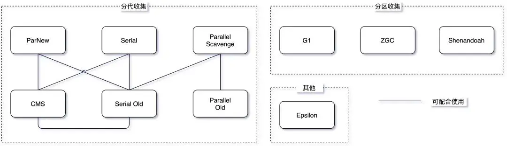

### 分代收集器

CMS 垃圾收集器通过三色标记算法，实现了垃圾回收线程与用户线程的并发执行，从而极大地降低了系统响应时间，运行过程分为 4 个步骤：

1. 初始标记：Stop the World，标记 GC Roots 能**直接关联**到的对象，很快
2. 并发标记：对初始阶段标记的对象进行整个引用链的扫描，耗时长，但与用户线程并发执行。可能会出现漏标和多标（因为并发时引用可能发生变化）
3. 重新标记：Stop the World，对并发标记阶段出现的问题进行校正
4. 并发清除：将标记为垃圾的对象进行清除

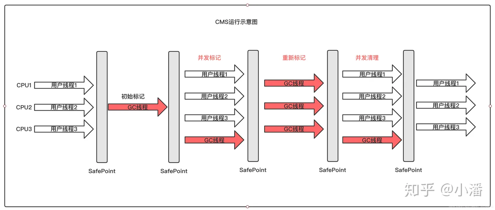

CMS 垃圾收集器：

优点：并发收集、低停顿

缺点：

1. 对 CPU 资源非常敏感，在 CPU 资源紧张的情况下， CMS 的性能会大打折扣

默认情况下，CMS 启用的垃圾回收线程数是（CPU数量 + 3)/4，当 CPU 数量很大时，启用的垃圾回收线程数占比就越小。但如果 CPU 数量很小，例如只有 2 个 CPU，垃圾回收线程占用就达到了 50%，这极大地降低系统的吞吐量，无法接受。

2. 采用的是标记-清除算法，会产生大量的内存碎片，导致空间不连续，当出现大对象无法找到连续的内存空间时，就会触发一次 Full GC，这会导致系统的停顿时间变长。
3. CMS 无法处理浮动垃圾，当 CMS 在进行垃圾回收的时候，应用程序还在不断地产生垃圾，这些垃圾会在 CMS 垃圾回收结束之后产生，CMS 无法处理这些浮动垃圾，只能在下一次 GC 时清理掉。

### 分区收集器

G1（Garbage-First Garbage Collector）在 JDK 1.7 时引入，在 JDK 9 时取代 CMS 成为了默认的垃圾收集器。G1 有五个属性：分代、增量、并行、标记整理、STW。

**分代**

将堆内存分为多个大小相等的区域（Region），每个区域都可以是 Eden 区、Survivor 区或者 Old 区

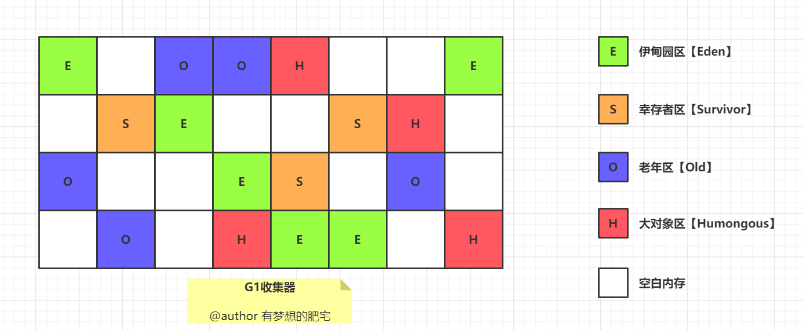

可以通过 `-XX:G1HeapRegionSize=n` 来设置 Region 的大小，可以设定为 1M、2M、4M、8M、16M、32M（不能超过）。

G1 有专门分配大对象的 Region 叫 Humongous 区，而不是让大对象直接进入老年代的 Region 中。在 G1 中，大对象的判定规则就是一个大对象超过了一个 Region 大小的 50%，比如每个 Region 是 2M，只要一个对象超过了 1M，就会被放入 Humongous 中，而且一个大对象如果太大，可能会横跨多个 Region 来存放。

G1 会根据各个区域的垃圾回收情况来决定下一次垃圾回收的区域，这样就避免了对整个堆内存进行垃圾回收，从而降低了垃圾回收的时间。

**增量**

G1 可以以增量方式执行垃圾回收，这意味着它不需要一次性回收整个堆空间，而是可以逐步、增量地清理。有助于控制停顿时间，尤其是在处理大型堆时。

**并行**

G1 垃圾回收器可以并行回收垃圾，这意味着它可以利用多个 CPU 来加速垃圾回收的速度，这一特性在年轻代的垃圾回收（Minor GC）中特别明显，因为年轻代的回收通常涉及较多的对象和较高的回收速率。

**标记整理**

标记整理：在进行老年代的垃圾回收时，G1 使用标记-整理算法。这个过程分为两个阶段：标记存活的对象和整理（压缩）堆空间。通过整理，G1 能够避免内存碎片化，提高内存利用率。

年轻代的垃圾回收（Minor GC）使用复制算法，因为年轻代的对象通常是朝生夕死的。

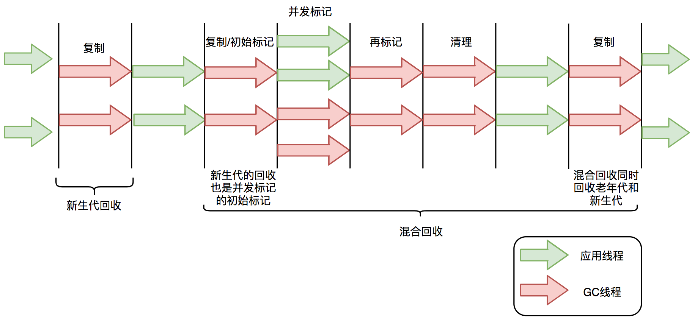

**STW**

G1 也是基于「标记-清除」算法，因此在进行垃圾回收的时候，仍然需要「Stop the World」。不过，G1 在停顿时间上添加了预测机制，用户可以指定期望停顿时间。

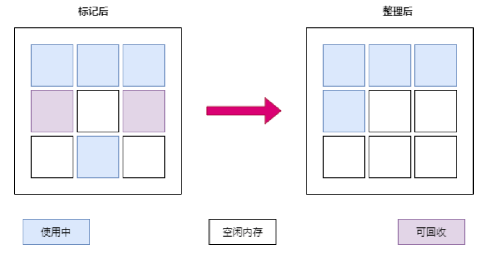

G1 中存在三种 GC 模式，分别是 Young GC、Mixed GC 和 Full GC。

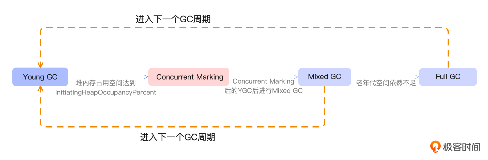

当 Eden 区的内存空间无法支持新对象的内存分配时，G1 会触发 Young GC。

当需要分配对象到 Humongous 区域或者堆内存的空间占比超过 -XX:G1HeapWastePercent 设置的 InitiatingHeapOccupancyPercent 值时，G1 会触发一次 concurrent marking，它的作用就是计算老年代中有多少空间需要被回收，当发现垃圾的占比达到 -XX:G1HeapWastePercent 中所设置的 G1HeapWastePercent 比例时，在下次 Young GC 后会触发一次 Mixed GC。

Mixed GC 是指回收年轻代的 Region 以及一部分老年代中的 Region。Mixed GC 和 Young GC 一样，采用的也是复制算法。

在 Mixed GC 过程中，如果发现老年代空间还是不足，此时如果 G1HeapWastePercent 设定过低，可能引发 Full GC。-XX:G1HeapWastePercent 默认是 5，意味着只有 5% 的堆是“浪费”的。如果浪费的堆的百分比大于 G1HeapWastePercent，则运行 Full GC。

在以 Region 为最小管理单元以及所采用的 GC 模式的基础上，G1 建立了停顿预测模型，即 Pause Prediction Model 。这也是 G1 非常被人所称道的特性。

我们可以借助 -XX:MaxGCPauseMillis 来设置期望的停顿时间（默认 200ms），G1 会根据这个值来计算出一个合理的 Young GC 的回收时间，然后根据这个时间来制定 Young GC 的回收计划。
